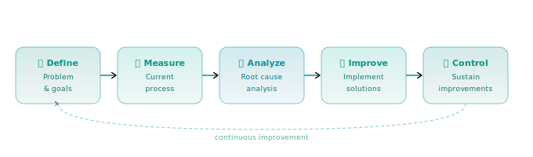

<!-- Header -->

# Hi, I'm Hope Liang 👋
### Operations & Program Management | Bay Area, CA

---

## 👩‍💼 About Me

> *"Turning complexity into clarity."*

I'm an operations and program management professional with **8+ years** of experience building efficient systems, managing cross-functional programs, and driving process improvements across regulated R&D and technical services environments.

I thrive where things need to be organized, tracked, and improved — and I bring both the systems mindset and the follow-through to make it stick.

- 🏢 Previously: **R&D Laboratory Coordinator (Systems & Operations Lead)** @ Align Technology
- 📍 Based in the **San Francisco Bay Area**
- 🎓 Pursuing **BS Business Administration (MIS)** @ SNHU *(expected 2027)*
- 🥋 **Lean Six Sigma Green Belt** certified
- 🤖 Actively building technical skills: GitHub, AI tools, workflow automation
- 📖 Currently open to opportunities in **Operations | Program Management | Lab Ops | Business Analysis**

---

## 🛠️ Skills & Tools

| I Have | I'm Learning | In the Memory Banks |
|--------|-------------|-------------------|
|  |  |  |
|  |  |  |
|  |  |  |
|  |  |  |
|  |  |  |
---

## ⚙️ Process Optimization Approach

**Outcomes I drive:**
- ⏱️ Reduced cycle times
- ✅ Improved compliance
- 📁 Better documentation
- 🤝 Clearer accountability

---

## 🤖 AI as a Tool

I actively use AI to work smarter — not to replace judgment, but to sharpen it.

- ✍️ **Communications** — fine-tuning documents and communications for clarity and accuracy
- 🧠 **Brainstorming** — generating ideas and stress-testing plans
- 📚 **Learning** — using AI as a tutor to pick up new technical skills fast
- ⚡ **Automation** — exploring AI-driven document storage and workflow automation
- 🔎 **Research** — summarizing information and getting up to speed quickly

---

## 📊 GitHub Stats

---

## 🌿 My Down Time

---

## 🌱 Currently Learning

---

*Currently open to full-time opportunities in operations, program management, lab operations, business analysis, and related fields. Let's talk!*

*Updated: 2026*

